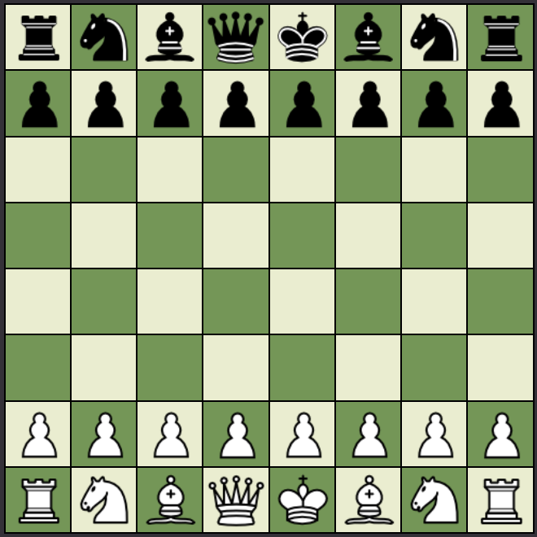
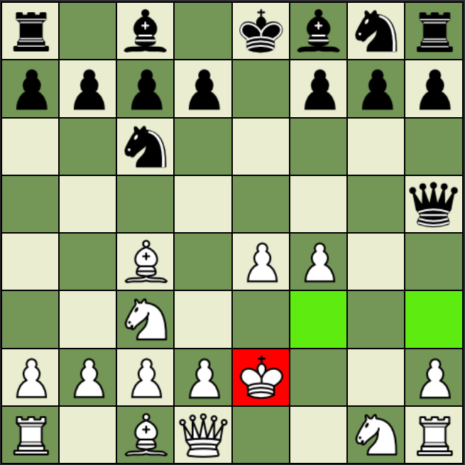

# Project 1: Browser-Based Game

<!--  -->

Chess browser-based game built using HTML, CSS, and JavaScript.

 

## Introduction
Chess is a popular board game played betweened two players where the objective is to trap the opponents King. The game starts with the white pieces making the first move and will alternate between the two players.

Each player has a total of 16 pieces which can be broken up to:
- 8 Pawns
- 2 Rooks
- 2 Bishops
- 2 Knights
- 1 Queen
- 1 King

For new players that may not know how the different pieces move.  Here is a guide to see how chess pieces move:
* [How the Chess Pieces Move](https://www.chessable.com/blog/how-the-chess-pieces-move/#:~:text=It%20can%20move%20horizontally%2C%20vertically,the%20same%20square%20as%20another.)

## Current Win-Condition
Traditionally in order to win, it is required for a player to trap the oppositing players king with no option of moving, blocking, or taking the attacking piece. This would "Checkmate" the opposite player.

    However in this version of chess, the win condition will be taking/capturing the King piece instead of trapping the piece.

 

## Different Technologies Used
- <b>HTML</b>
    * Created the foundation of the piece and chessboard properties.
- <b>CSS</b>
    * Styled and positioned the browser-game application.
- <b>JavaScript</b>
    * Used to manupulate movement of pieces and data transfer.
    * Updates the board and pieces visually through using DOM events.

## Screenshots of the Game

Chessboard - Starting Position

 

Chessboard - White King in Check

 

Lets get started!
Access the game through the link below:

[Chess - Click Here](https://edwinhawkyu.github.io/Chess/)

## Future enhancements
1. Stalemate, Checkmate, Undo Button, and Move-prevention.

2. Add computer AI opponent option.

3. Update JS to include a nested array containing all of the piece details.

4. Add castling and en passant functions.